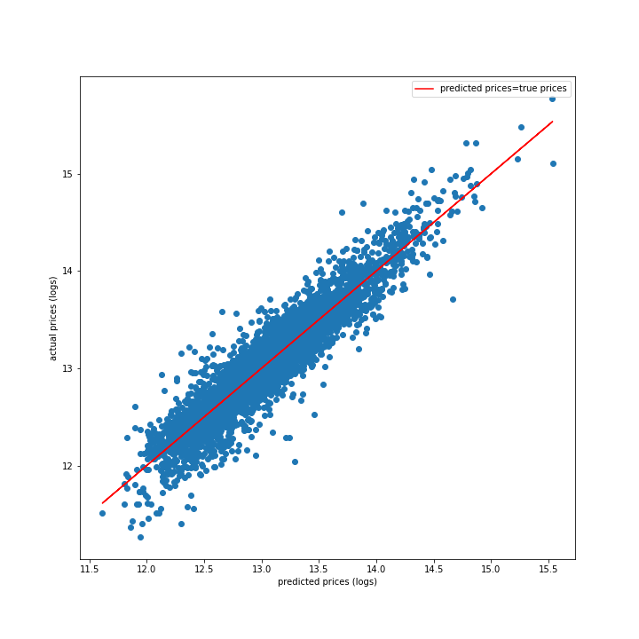

# Recommendations for Selling Your King County Home

In this study, I've produced recommendations for homeowners in King County, WA who are interested in selling their homes. My recommendations answer two important questions that are common among prospective sellers: 

1. Will improvements add value to my home?
2. Is there a best time of year to sell my home?

## The Model

Using a data set of homes sold in Kings County between May 2014 and May 2015, I built a linear regression model that predicts home prices based on a variety of factors such as lot size, home condition, and zipcode. In addition to predicting prices, the model also enables us to isolate the specific effects of four types of improvements on home prices and to determine the best time of year for clients to sell their homes.

In building my regression model, I included sale month and zipcodes as dummy variables. While sale month didn't have a big effect on the model, the inclusion of zipcodes decreased the model's variance by 20%. I also ensured that continuous variables (including the target variable, price) were normally distributed by converting them to log values. 

Because I converted my target variable to log values, coefficients should be interpreted as scaling the target variable by a factor of e^(beta_i * x_i). For predictive variables expressed as logarithms, coefficients can be interpreted as scaing the target variable by a factor of x_i^beta_i. This roughly translates to a beta_i% increase in the target variable for every 1% increase in the predictive variable.

## Validation

The model performed well on a series of kfolds cross-validation tests, accounting for an average of 88% of test data variance. The figure below shows how the model performed on a set of test data representing 25% of the data set after having been trained on the other 75% of the data set. 

## Effect of Improvements

According to our model, we have 97.5% percent confidence that:

- 1 point increment in grade: > 10% appreciation
- 1 point increment in condition: > 4% appreciation
- 1 additional bathroom: > 4% appreciation
- 1% increase in living area: > ~0.38% appreciation

By using our model to calculate the current value of a home, we can use the numbers above to calculate the minimum appreciation of a home due to a proposed improvement with 97.5% confidence. Then we can find the risk-adjusted expected value of the improvement by multiplying this amount by 0.975. This expected value is the maximum amount that homeowners should spend on making a given improvement. 

## Effect of Sale Month

In addition to determining the expected value of improvements, our regression model also shows that March and April are the best times to sell a home. Homes sold in March go for around 5% more than the January baseline, while homes sold in April go for around 7% more than the January baseline. Based on our model, no other months showed a similar price premium.
